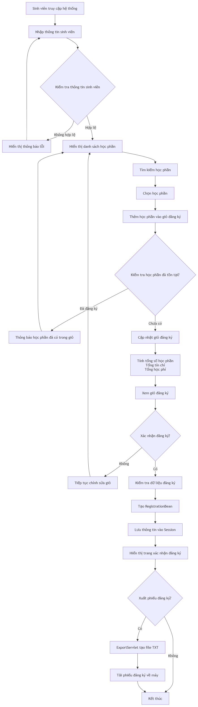
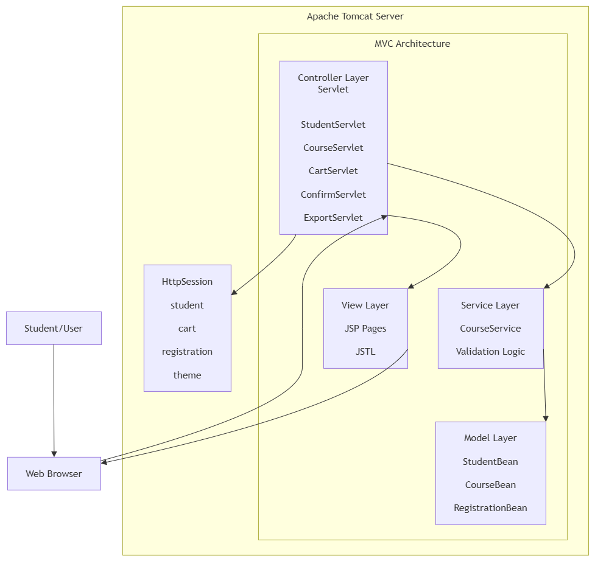
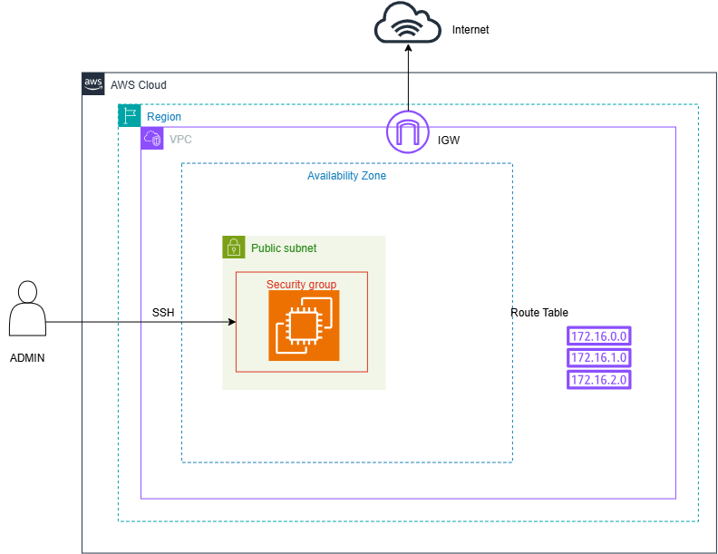

# Cổng Đăng Ký Học Phần Trực Tuyến

## 1. Giới thiệu

Cổng Đăng Ký Học Phần Trực Tuyến là hệ thống hỗ trợ sinh viên đăng ký các học phần.

Hệ thống cho phép sinh viên nhập thông tin cá nhân, tìm kiếm học phần, thêm học phần vào giỏ đăng ký, kiểm tra thông tin trước khi xác nhận và xuất phiếu đăng ký sau khi hoàn tất.

Dự án được xây dựng nhằm áp dụng kiến thức lập trình web với J2EE sử dụng mô hình Servlet/JSP, quản lý session và xử lý dữ liệu phía server.

## 2. Công nghệ sử dụng

### Backend
- Java Servlet
- JSP (JavaServer Pages)
- Apache Tomcat (8.5+)

### Frontend
- HTML
- CSS

### Quản lý dự án
- Git / GitHub

### Deployment
- AWS(Amazon Web Services) EC2 instance
- VPC, Subnet, Security Group, Key Pair, Route Table, Internet Gateway
## 3. Chức năng chính

### Quản lý thông tin sinh viên
- Nhập thông tin sinh viên:
    - MSSV
    - Họ tên
    - Email
    - Số điện thoại
    - Ngành học
    - Khóa học
    - Ghi chú (nếu có)
  
### Tra cứu học phần
- Hiển thị danh sách học phần
- Tìm kiếm học phần theo:
    - Mã học phần
    - Tên học phần

### Giỏ đăng ký học phần
- Thêm học phần vào danh sách đăng ký
- Xóa học phần khỏi giỏ
- Tính toán:
    - Tổng số học phần
    - Tổng số tín chỉ
    - Tổng học phí

### Xác nhận đăng ký
- Kiểm tra thông tin sinh viên
- Kiểm tra danh sách học phần
- Tạo mã đăng ký
- Hiển thị phiếu xác nhận

### Xuất phiếu đăng ký
- Xuất thông tin đăng ký ra file `.txt`
- Bao gồm:
    - Mã đăng ký
    - Thời gian xác nhận
    - Thông tin sinh viên
    - Danh sách học phần
    - Tổng tín chỉ
    - Tổng học phí

### Giao diện
- Hỗ trợ Dark Mode
- Thiết kế theo phong cách Academic SaaS
- Sử dụng Session để lưu trạng thái người dùng

## 4. Luồng hoạt động của hệ thống

## 5. Quản lý Session
Hệ thống sử dụng HttpSession để lưu trữ dữ liệu trong quá trình đăng ký.

Các dữ liệu được lưu trong Session:

| Attribute | Mục đích |
|---|---|
| student | Lưu thông tin sinh viên |
| cart | Lưu danh sách học phần đang chọn |
| registration | Lưu thông tin đăng ký sau khi xác nhận |
| theme | Lưu chế độ giao diện |

## 6. Kiến trúc xử lý


### Controller
Xử lý request từ người dùng:
- StudentServlet
- CourseServlet
- CartServlet
- ConfirmServlet
- ExportServlet

### Model
Các Java Bean đại diện dữ liệu:
- StudentBean
- CourseBean
- RegistrationBean

### View
Các trang JSP:
- Trang nhập sinh viên
- Trang danh sách học phần
- Trang giỏ đăng ký
- Trang xác nhận

---

## 7. Cách chạy dự án

### Yêu cầu môi trường

- JDK 17+
- Maven
- Apache Tomcat 8.5+

### Build project

```bash
mvn clean package
```
Sau khi build thành công:
target/
└── 23110056_PhamQuocTuan_J2EE_FinalProject-1.0-SNAPSHOT.war
Copy file WAR vào thư mục: apache-tomcat/webapps/
Khởi động Tomcat: bin/startup.sh
http://localhost:8080/23110056_PhamQuocTuan_J2EE_FinalProject-1.0-SNAPSHOT/

## 8. Deployment


### Deployment Flow
```text
User
 |
 v
Internet Gateway
 |
 v
EC2 Instance
 |
 v
Apache Tomcat
 |
 v
J2EE Application (.war)
```

### Các thành phần:
- VPC
- Public Subnet
- Internet Gateway
- Route Table
- Security Group
- EC2


## 9. Cấu trúc dự án
src
└── main
├── java
│   └── com.tuan
│       ├── controller
│       ├── dto
│       ├── error
│       ├── mapper
│       ├── model
│       ├── service
│       └── util
│
└── webapp
    ├── views
    ├── includes
    ├── css

## 10. Thành viên thực hiện
Phạm Quốc Tuấn
